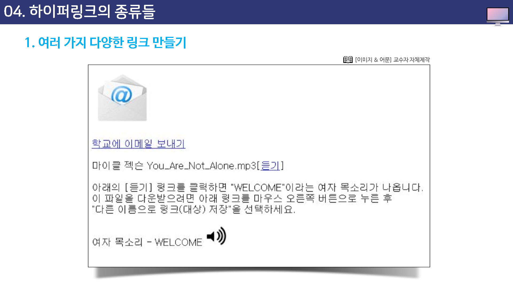
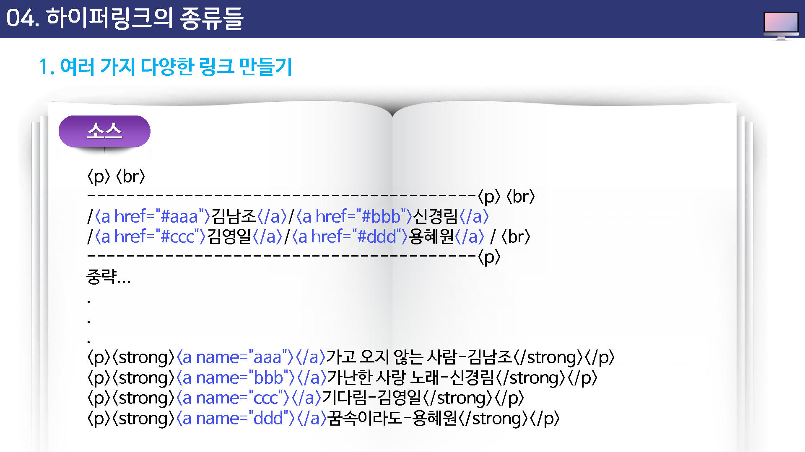
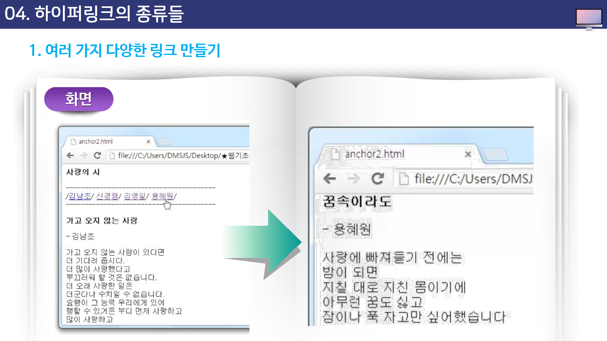

# 하이퍼링크의 종류들


## 다양한 링크 만들기

지금까지 텍스트와 이미지에 링크를 만드는 방법을 알아보았다. 홈페이지뿐만 아니라 게시판 등에서 사용할 수 링크는 의외로 많다.

* 메일링크
* 다운로드 링크
* 음악 듣기 링크
* 문서의 특정 위치로 옮겨가기


## 메일 링크

메일 링크는 링크를 클릭했을 때 자동으로 이메일 프로그램이 실행되면서 메일을 보낼 수 있게 해주는 링크이다.

이 때 메일을 받을 사람들의 주소가 자동 입력되므로 편리하게 메일을 보낼 수 있다.

```html
<a href='mailto:메일주소'>메일 보내기</a>	
```


## 다운로드 링크

홈페이지나 게시판에서 파일을 다운로드하게 하려면 일단 해당 파일을 인터넷에 업로드 해야 한다.

홈페이지를 운영하고 있다면 먼저 자신의 홈페이지에 파일을 올려 놓고 그 파일 주소를 연결하면 된다.


zip파일이나 hwp 파일등은 브라우저에 표시할 수 없기 대문에 대안로드로 연결이 되지만,

gif나 jpg, htm 처럼 웹 브라우저에ㅓ 사용하는 파일 형식일 경우 다운로드 되지 않고 브라우저 창에서 그대로 표시된다.


그런데 최근에는 브라우저 기능이 좋아지면서 웬만한 파일의 경우 브라우저 안에 그대로 표시되어 버린다..

즉, 다운로드해서 저장해야 하는데 저장이 되지 않는다.


이럴 경우에는 링크를 마우스 오른쪽 버튼으로 클릭해서 `다른 이름으로 대상 저장`을 선택하면 저장할 수 있다.

따라서 사이트 방문자에게 이런 방법을 미리 알려주는 것도 좋다.


```html
<a href='html.zip'>다운로드</a>
```


## 음악 듣기 링크

링크를 클릭했을 때 음악을 들을 수 있게 하는 링크이다.

이 경우에도 다른 링크를 만들 때 와 마찬가지로 음악 파일을 그대로 링크하면 된다.


```html
<a href='music.mp3'>음악듣기</a>
```





## 문서의 특정 위치로 옴겨가기 : name  속성

웹 문서가 너무 길 경우 문서 안에 위치를 지정해 놓고 그 위치로 한 번에 이동할 수 있다.

이를 앵커(anchor)라고 한다.


ㅇ


웹 문서의 내용이 너무 길어 스크롤이 생길 경우 내용 파악을 위해서 스크롤을 움직이기 보다는 문서의 상단에 만들어 놓은 앵커 태그를 통해서 바로 이동하는 것이 편리함을 준다.

문서의 특정 위치로 바로 이동하는 앵커에 대해 이해하기 위해서는 집 주소와 편지봉투에 스는 우편 주소의 예로 이해하는 것이 보다 쉬울 수 있다.


예를들어, 어던 특정 지역에 사는 친구에게 편지를 보내기 위해서는 먼저 친구의 집주소 (name=이름)를 리미 알고 있어야만 한다.

다음으로 그 친구의 주소를 편지 봉투 (href=#이름)에 정확히 기재하고 우표를 붙여야 우편 발송이 이루어 질 수 잇다.

이처럼, 이동하기 원하는 내용에 먼저 집주소(name=이름)을 만들고 문서 최상단에 해당 내용의 제목(href=#이름)을 만들어 이 제목을 클릭할 때 바로 해당 내용으로 이동하게 되는 것이다.


* 앵커를 사용하려면 `<a href="#앵커이름">택스트 또는 이미지</a>`
* 앵커를 만들려면 `<a name="앵커이름">텍스트 또는 이미지</a>`


아래는 앵커 태그가 적용된 웹 문서로 상단 부분에 이동하고자 하는 내용의 제목(href=#이름)이 있고, 이를 큭릭하면 동일한 집주소(name=이름)가 있는 내용으로 이동하는 소스를 확인할 수 있다.




