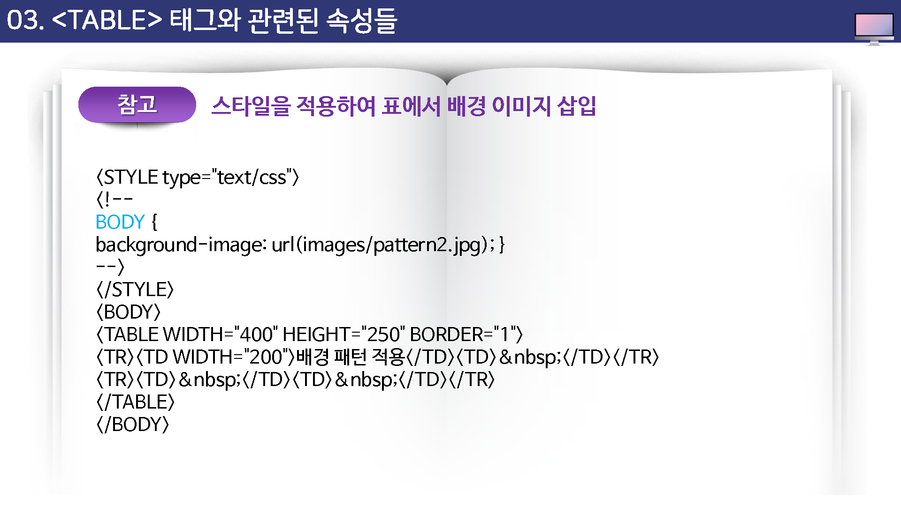
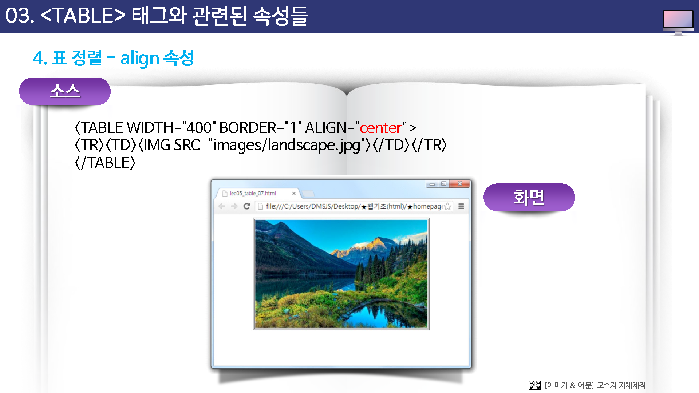
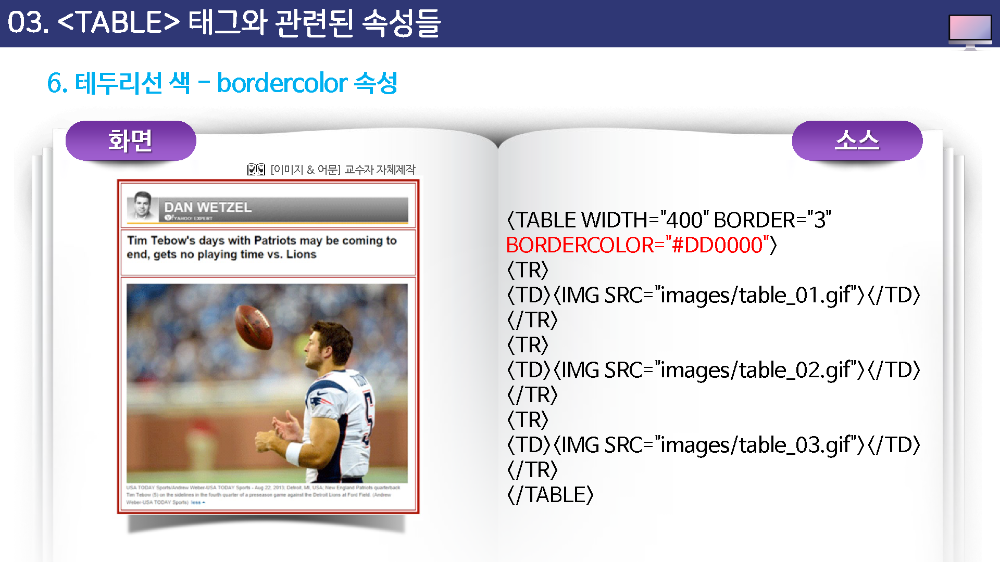
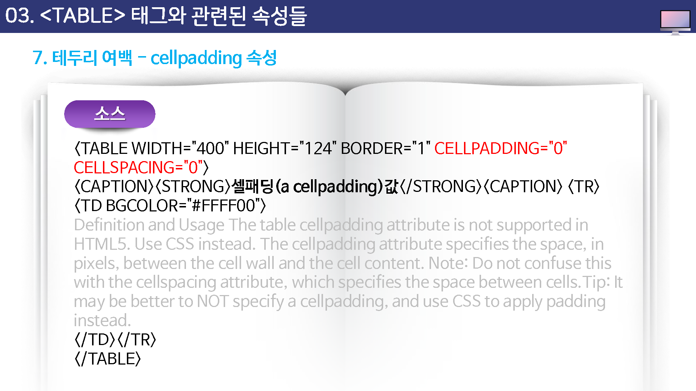

# 테이블 태그와 관련된 속성들

이제 table 태그의 여러 가지 속성을 하나씩 배워 보기로 하자.

표를 그릴 경우 표 주변의 테두리선 뿐만 아니라 표의 크기, 표의 정렬 방법등 여러 가지 속성을 table 태그의 속성들을 통해 조절할 수 있다. 

기본 형식은 다음과 같다.

```
<table 속성=값>
...
</talbe>
```


속성종류

* width : 표의 폭을 지정한다.
* background: 배경 이미지를 지정한다.
* bgcolor : 배경색을 지정한다.
* align : 표의 정렬 방법을 지정한다.
* border : 표의 테두리선 두께를 조절한다.
* bordercolor : 표나 칸의 테두리선 색상을 지정한다.
* cellpadding: 셀의 안 여백을 조절한다.
* cellspacing : 셀과 셀사이의 여백을 조절한다.


## width  속성

width를 사용하면 표의 폭을 조절할 수 있는데 픽셀 밧으로 지정할 수도 있고, 퍼센트 값으로 지정할 수도 있다.

표의 폭을 퍼센트 값으로 지정하면 현재 열려 있는 웹 브라우저 항의 폭을 기준으로 계산된다.

예를 들어, 표의 폭을 70%로 지정했는데 현재 웹 브라우저 창의 폭이 800 픽셀이라면 실제 표의 폭은 800픽셀 x 70% = 560 픽셀이 된다.


표의 폭을 픽셀 단위로 지정할 때와 퍼센트 단위로 지정할 때의 하이점은 브라우저의 크기에 상관하지 않고 테이블의 크기가 항상 일정하게 유지(고정폭)하거나

아니면 브라우저의 크기에 따라 테이블의 크기가 변동(가변폭)하는 것이다.


## background 속성

```
style=background-image:url(이미지경로)
```


background 속성을 사용하면 표 안에 배경이미지를 넣어 표 안의 내용을 좀 더 강조할 수 ㅇㅆ다.

이 속성은 table 태그 뿐만 아니라 td 와 th 태그에서도 사용할 수 있는데 이럴 경우에는 셀 하나에 배경 이미지가 삽입된다.





### 표에 배경색 넣기 


bgcolor 속성 / style=background-color:컬러값

표 전체나 일부 셀에만 배경색을 넣을 수도 있는데 이렇게 하면 셀을 좀더 명확히 구분해 주기 때문에 항상 일정한 사각형 표의 모습을 깔끔하게 만들 수 있다.

표 전체에 배경색을 넣고 싶다면 table 태그에 bgcolor 속성을 사용하고, 특정 부분에만 배경색을 넣고 싶다면 tr 태그나 td, th 테그에서 bgcolor 속성을 사용하면 된다.


## align 속성

table 태그 안에 사용하는 align 속성은 표의 정렬 방법을 지정한다.

사용할 수 있는 값은 left와 right, center 이고 따로 align 속성을 설정하지 않으면 기본으로 왼쪽 정렬된다.





###  테두리선을 보이지 않게 : border 속성

표의 테두리선이 없도록 테두리선을 없앨 수도, 원하는 굵기로 지정할 수도 있다.

이때 사용하는 것이 border 속성이다.

웹 문서의 레이아웃을 잡기 위해 표를 사용한다면 테두리선을 표시하지 않는 것이 좋다. 이럴 경우에는 border=0으로 지정한다.


### 테두리선 색 : bordercolor  속성

앞에서 설명한 border 속성을 사용해서 표에 테두리선을 만들엇을 경우 bordercolor 속성을 사용해서 테두리선에 원하는 색상을 입힐 수 있다.

border=0 일 경우에는 의미가 없다.





### 데두리 여백 : cellpadding 속성

cellpadding 속성은 셀 테두리선과 내용 사이의 여백을 조절한다.

cellpadding 속성을 지정하지 않을 경우 셀의 내용이 셀의 테두리선에 바작 붙여서 표시되는데, 적절하게 cellpadding 을 설정해 주면 훨씬 깔금한 표를 유지할 수 있다.


표의 테두리선을 표시하지 않는 상태에서 셀과 셀 사이가 떨어져 보일 경우에는 cellpadding 과 다음에 배울 cellspacing을 모두 0으로 설정하면 셀과 셀 사이가 바짝 붙어서 표시된다.





### 셀과 셀 사이 여백 : cellspacing 속성

여러 셀로 구성된 표에서 셀과 셀 사이를 조금 여유롭게 띄어야 할대 cellspacing 속성을 사용한다.

cellpadding 이 셀의 안 여백을 조절하는 속성이다.


여러 셀로 구성된 표에서 셀의 바깥 여백을 조금 여유롭게 띄어야 할때 cellspacing 속성을 사용한다.

cellspacing 속성을 사용하지 않을 경우  cellspacing=0으로 인식해서 셀과 셀 사이에 여백이 생기지 않는다.


