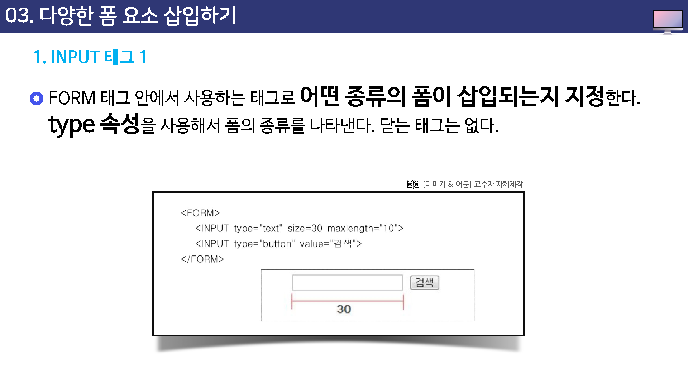
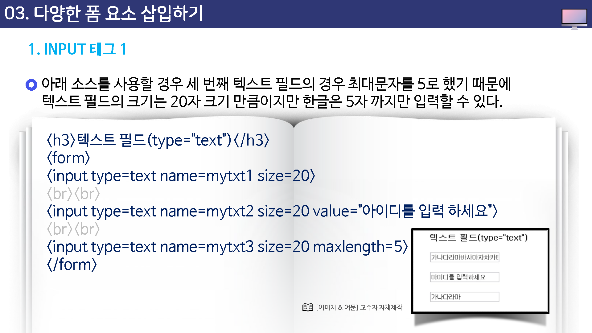
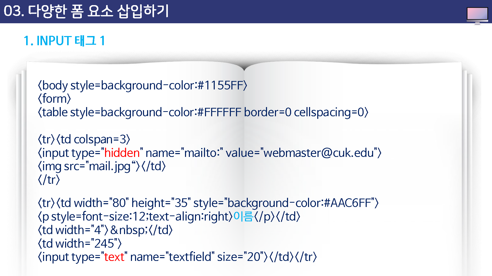
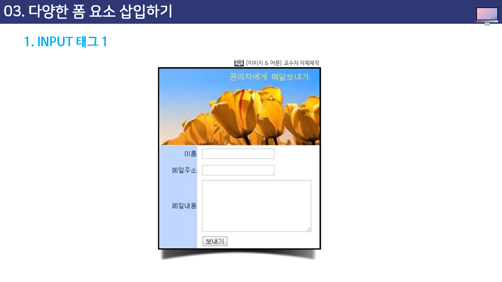
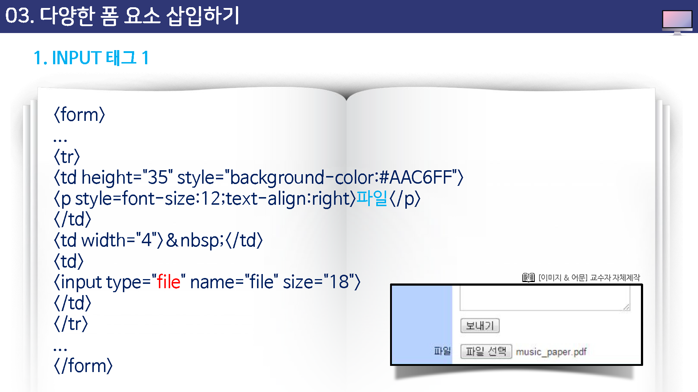
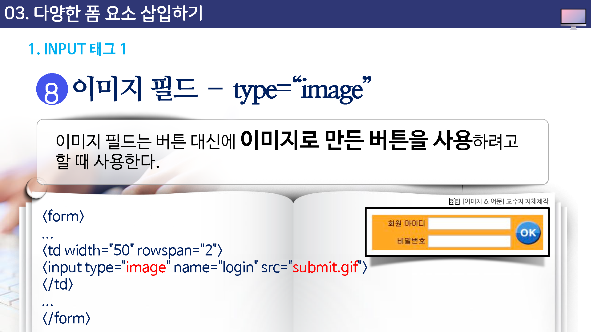

# 다양한 폼 요소 삽입하기

FROM 테그 안에서 사용하는 태그로 어떤 종류의 폼이 삽입되는지 저장한다.

type속성을 사용해서 폼의 종류를 나타낸다.

닫는 태그는 없다.

---

FORM 태그 안에서 사용하는 태그로 `어떤 종류의 폼이 삽입되는지 지정`한다.

type 속성을 사용해서 폼의 종류를 나타낸다. 닫는 태그는 없다.

### 텍스트 필드 : type="text"

한 줄 짜리 텍스트를 입력 할 수 있게 삽입하는 폼 요소이다.

텍스트 필드 상자 안에 커서를 갖다 놓고 원하는 텍스트를 입력할 수 있다.

* name : 텍스트 필드의 이름이다.\
* size : 텍스트 필드의 길이. 화면에 몇 글자 정도 크기로 표시할 것인지 지정하는 것이다. 영문 글자 단위로 지정하는데 한글 1자는 영문 2자에 해당한다.
* value : 입력 양식이 표시될 때 처음 화면에 표시되는 텍스트이다.
* maxlength: 사용자가 텍스트 필드에 입력할 수 있는 최대 문자 개수이다.

### 패드워드 필드 : type="password"

패스워드 필드는 텍스트 필드와 똑같지만 암호를 입력할 때 화면에 *로 된다는 점이 다르다.

속성 역시 value 속성이 없다는 점만 제외하면 텍스트 필드와 똑같다.

### 라디오 버튼 : type="radio"

라디오 버튼은 `여러 항목 중 한가지만 선택`하게 할 경우 사용한다.

예를 들어 객관식 시험 답안을 만들 경우 답 항목 앞에 라디오 버튼을 사용하면 된다. 라디오 버튼들은 선택을 위한 것이브로 2개 이상이 하나의 그룹으로 묶여 있어야 하며, 그룹 내의 각 라디오 버튼들은 이름이 같아야 한다. 그리고 vlaue 속성을 꼭 넣어주어야 하는데, 그 이유는 사용자가 항목을 선택했을 때 그 라디오 버튼이 가지고 있는 value 값이 서버로 넘겨지기 때문이다. 여러 항목 중 한 가지를 기본값으로 표시해 놓고 싶다면 checked 속성을 이용한다.

* name : 하나의 그룹을 이루는 라디오 버튼의 이름
* value : 폼을 처리할 프로그램으로 넘겨줄 라디오 버튼 항목의 값

### 체크박스 : type = "checkobx"

나열된 항목들 중에서 여러 항목을 선택할 수 있게 할 때 사용한다.

체크박스 버튼 역시 2개 이상의 버튼이 하나의 그룹으로 묶여 있어야 하며, 그룹으로 묶인 버튼들의 name은 모두 같아야 한다. 그리고 라디오 버튼과 마찬가지로 체크박스 항목을 선택했을 때 그 항목이 가지고 있는 value값이 서버로 넘어가야 하기 때문에 value 속성은 꼭 넣어야 한다.

그리고 checked 속성을 사용하면 기본값에 체크 표시를 할 수 있는데, 라디오 버튼과 달리 체크박스에서는 두 개 이상을 checked로 지정할 수 있다.

### 버튼 : type="submit", type="reset", type="button"

웹 문서에 버튼을 표시할 때 사용하는 폼 요소이다.

버튼을 클릭했을 때 어떤 동작을 할 것 인지에 따라 사용되는 유형이 다르다.

선택할 수 있는 유형(type)은 다음과 같다.

버튼의 유형

* submit : form 태그의 action에서 지정한 서버 컴퓨터 내의 프로그램을 실행한다.
* reset : 입력 양식에 입력했던 내용을 모두 지운다.
* button : 웹 문서에 버튼 형태만 만든다. 이런 버튼은 버튼을 클릭했을 때 서버에 있는 프로그램이 아니느자바스크립트 함수를 실행 하려고 할때 주로 사용한다.

그리고 버튼 폼에서 사용할 수 있는 속성은 다음과 같다.

* name : 다른 폼 요소들과 구분할 수 있게 버튼에 이름을 부여한다.
* value : 버튼에 표시될 내용이다.

### 히든필드 : type = "hidden"

브라우저 창에서 표시되지 않지만 서버에 있는 프로그램을 실행하기 위해 필요한 값을 폼 안에 넣을때 사용하는 요소이다.

예를 들어, 웹 문서에서 내용을 입력한 후 <보내기>를 클릭하면 관리자에게 메일을 보내도록 폼을 만들 경우 관리자 메일 주소는 히든 필드로 삽입한다.

### 파일 필드 : type="file"

흔히 게시판 등에서 파일을 업로드 할 때나 양식 문서에 파일을 첨부할 때 사용된다.

이 필드를 넣게 되면 브라우저 화면에 [찾아보기...]라고 표시되는데 이 단추를 클릭한 후 원하는 파일을 선택하면 파일을 첨부할 수 있게 된다.

이때 size 속성 크기를 이용해서 [찾아보기]버튼 앞의 텍스트 부분의 크기를 조절할 수 있다.

> 익스플로러에서는 [찾아보기...]로 표시되고 구글에서는 [파일선텍]로 표시된다.

### 이미지 필드 : type="image"

이미지 필드는 버튼 대신에 이미지로 만든 버튼을 사용하려고 할 때 사용한다.

