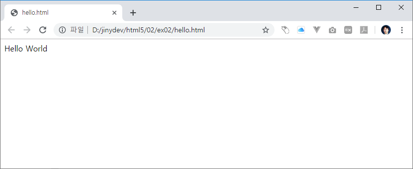
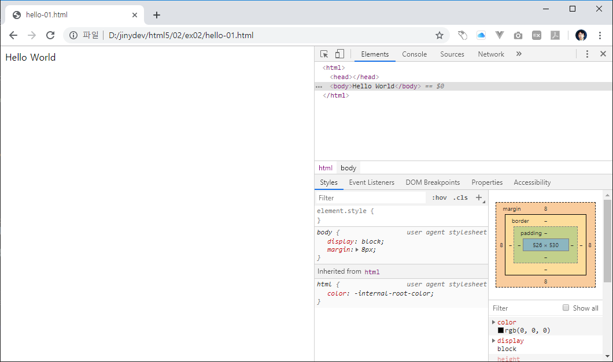

# 인사말 출력
웹 브라우저에서 확인을 할 수 있는 인사말을 문서를 생성해 봅니다.

## 인사말 작성
새로운 `hello.html` 파일이 생성이 되었습니다. 아직 아무것도 없는 비어있는 파일입니다.
다음과 같이 내용을 입력합니다.

```html
Hello World
```

파일을 저장합니다. 파일이 수정이되면 상단 파일명 탭에 * 표시가 같이 출력이 됩니다. 이는 아직 파일이 수정후에 저장이 되어 있지 않다는 것을 표시하는 것입니다.  
vscode에서 `file->save`를 선택합니다. 또는 단축키 `ctrl+s`를 입력합니다.

> 자동저장
> vscode는 파일이 수정되면 자동으로 저장할 수 있도록 환경옵션을 설정할 수 있습니다.
> `file->preferences->setting` 을 선택합니다. `commonly->auto save`를 설정합니다.


## 확인
작성한 `hello.html` 파일을 웹 브라우저로 확인을 합니다. 크롬 브라우저 url에서 로컬 컴퓨터의 파일 위치를 입력합니다.

작성예시)
```
file:///D:/jinydev/html5/02/ex02/hello-01.html
```

결과확인


## 코드확인
크롬 브라우저를 통하여 개발화 도구를 활성화 합니다. 단축키 `f12`를 누르면 오른쪽에 크롬 개발자 도구가 활성화 됩니다.
개발자 도구에서 `Elements` 텝을 클립합니다.

결과확인


우리는 앞에서 `hello world` 라는 텍스트만 입력을 하였습니다. 하지만, 그외 다른 코드들이 같이 출력이 되는 것을 확인할 수 있습니다.

